# Module 10: Azure Devops Services

## Practical Task 1: Create and Initialize a New Repository with a README

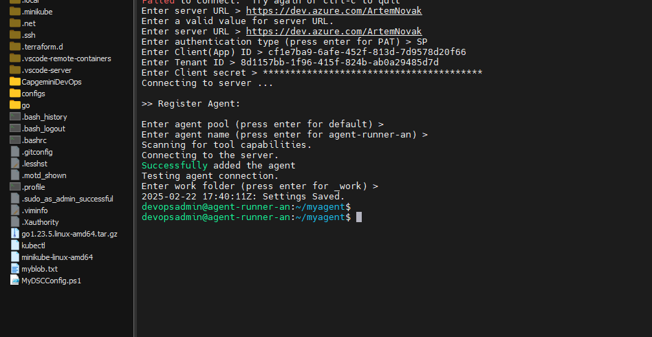
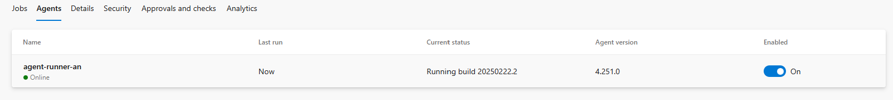
Description: Agent Connection

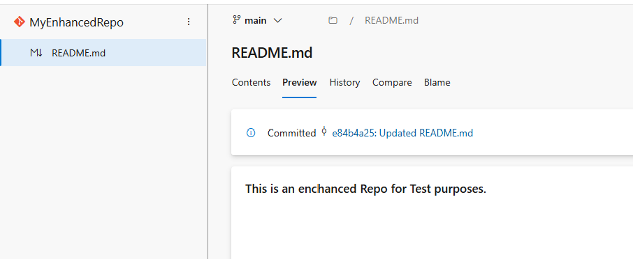
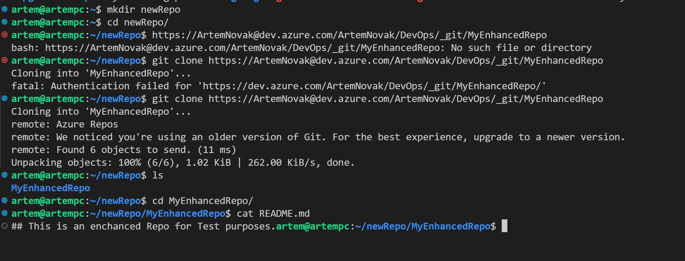
Description: Git

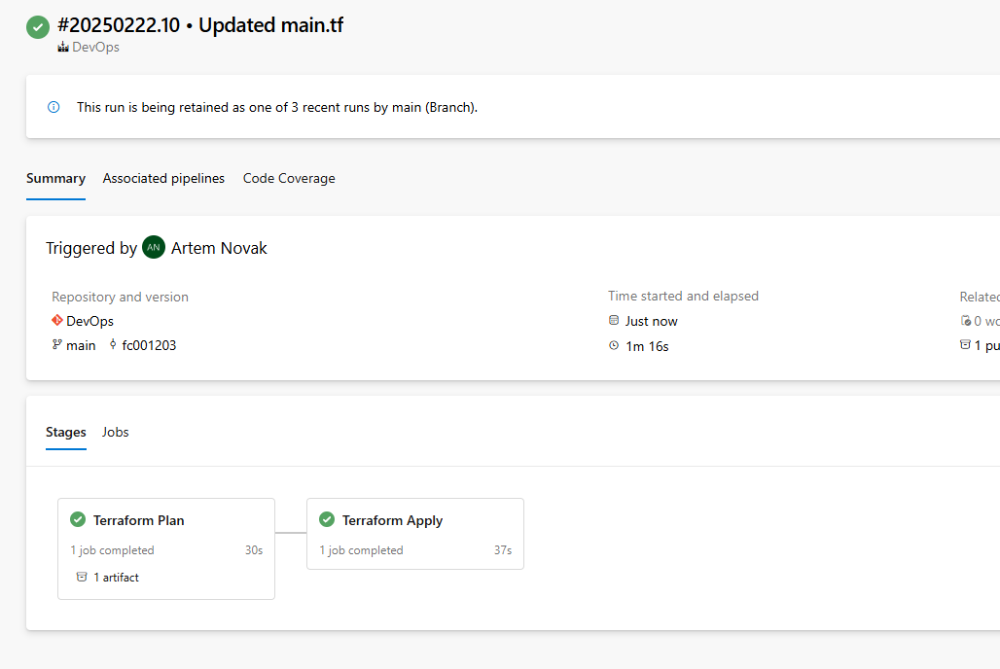
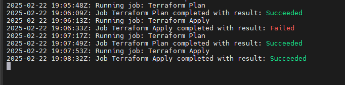
Description: Git

## Practical Task 2: Implement Branching and Merging

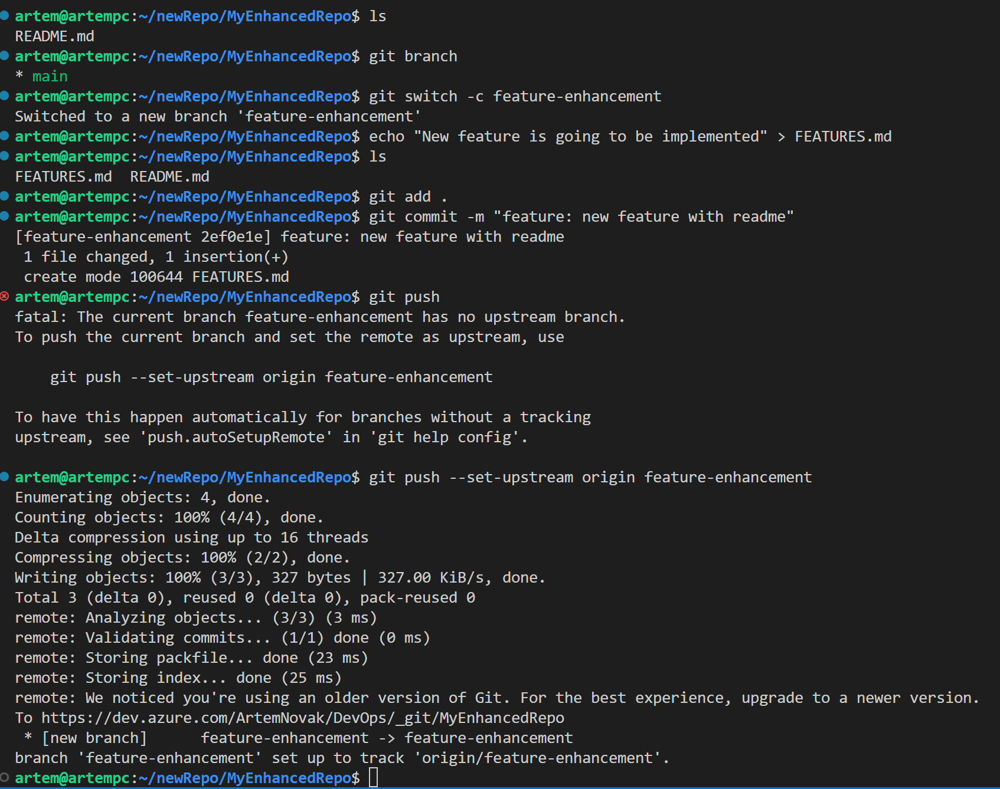
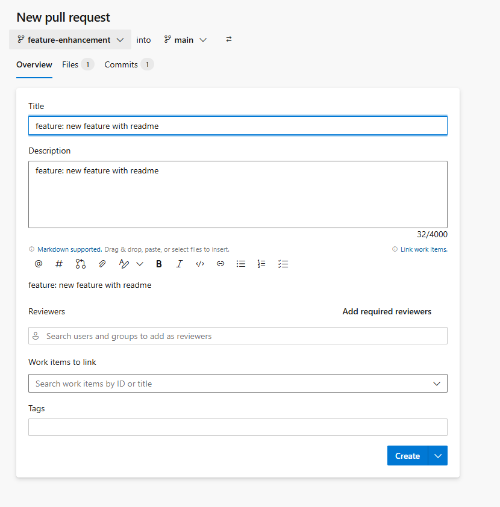
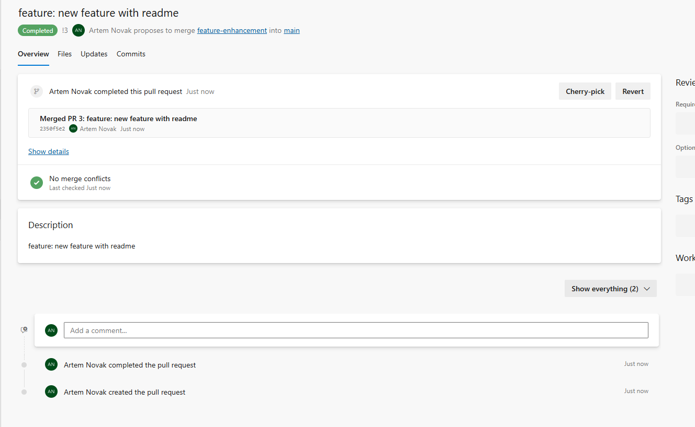
Description: Git

## Practical Task 3: Set Up Branch Policies and Code Review

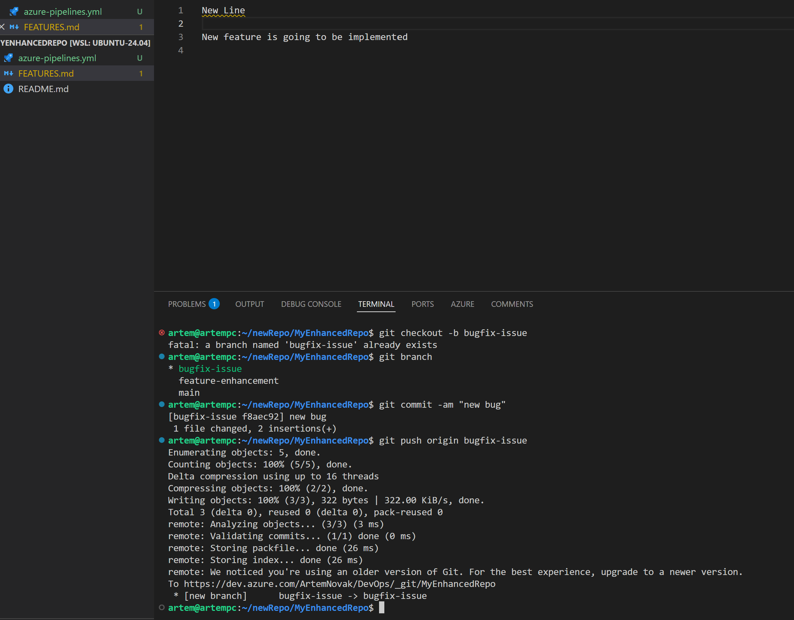
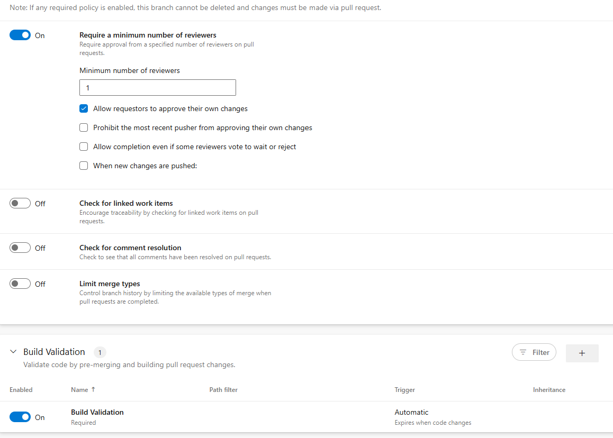
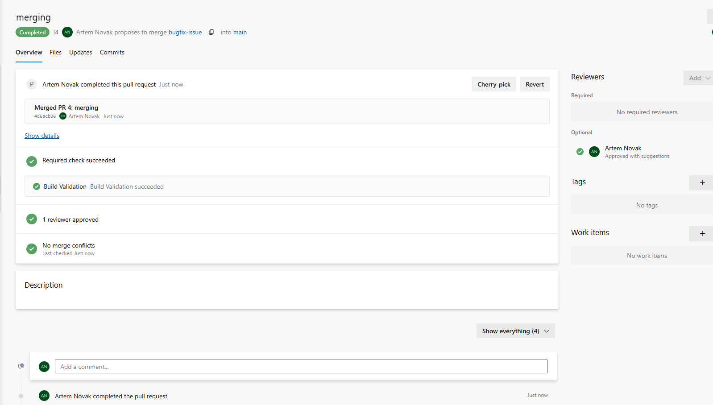
Description: Merging PR

## Practical Task 4: Create a Simple Build Pipeline in Azure DevOps

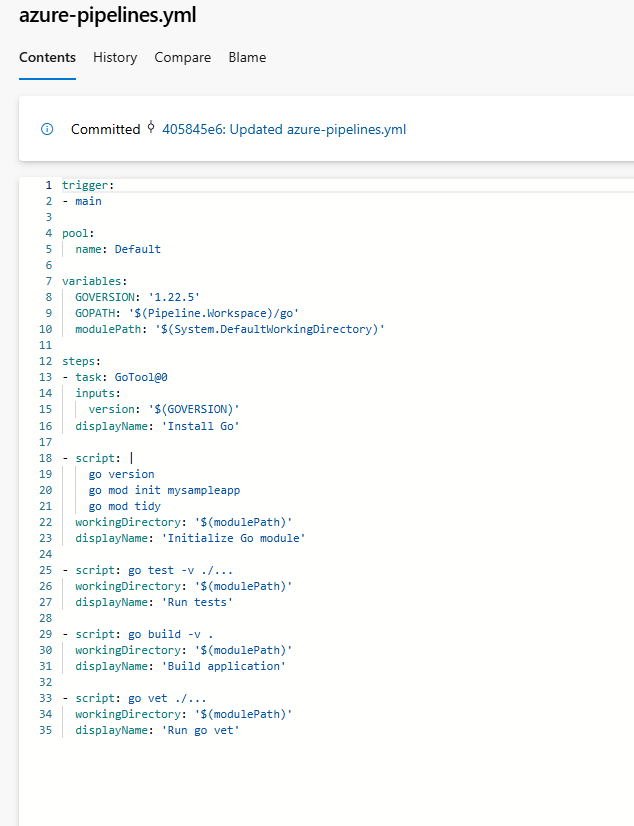
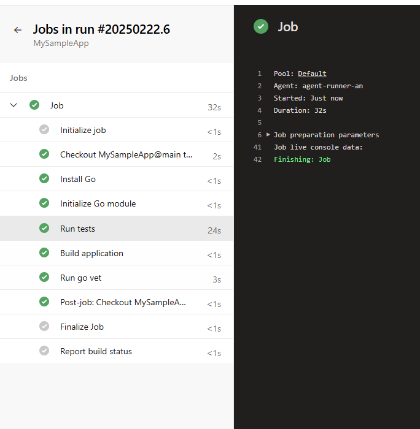
Description: CI

## Practical Task 5: Set Up Continuous Deployment (CD) to Azure Web App

## Practical Task 6: Implement CI/CD with GitHub and Azure Pipelines

## Practical Task 7: Use Azure Artifacts to Manage Dependencies

## Practical Task 8: Deploy Infrastructure as Code (IaC) with Bicep

## Practical Task 9: Implement Infrastructure as Code (IaC) with Terraform

## Practical Task 10: Integrate Azure Test Plans with CI/CD Pipelines

## Practical Task 11: Practical Task 11: Full CI/CD Pipeline with Infrastructure as Code, Testing, and Artifact Management
