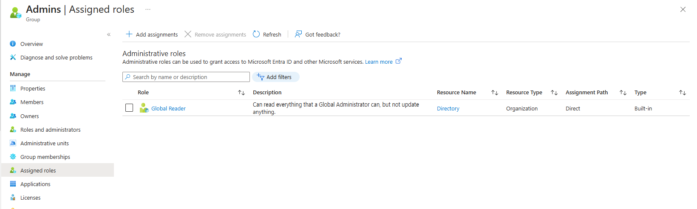
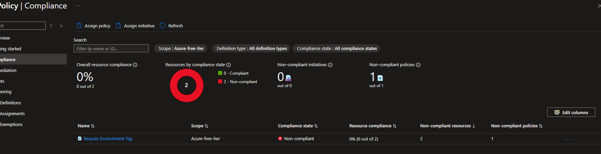

# Module 2: Azure Identity and Access Management

## Practical Task 1: Introduction to Microsoft Entra ID

Description: New Entra with P2

Description: Newly created users

Description: Displays Azure AD groups

Description: Roles for Developers and Admins

## Practical Task 2: Enabling Single Sign-On (SSO) and Multi-Factor Authentication (MFA)

Description: SSO Login by dev.one

Description: MFA for all users

Description: Conditional Access

Description: Verifing MFA and conditional access

## Practical Task 3: Implementing Role-Based Access Control (RBAC)

Description: Custom Role

Description: Assaigning Custom Role

Description: Assaigning Contributor to Admins

Description: Assaigning Contributor to Admins

Description: Verifing the roles

## Practical Task 4: Securing Sensitive Information with Azure Key Vault

Description: Creating a vault and assinging a key

Description: Reading rights for developers

Description: Checking reading rights by developers

Description: Checking if the deletion is possible

## Practical Task 5: Creating and Assigning Basic Azure Policies

Description: Creating a require environment tag policy

Description: Verifying non-compliance

## Practical Task 6: Using Policy Effects to Enforce Compliance

Description: Audit tag and deploy tag policies

