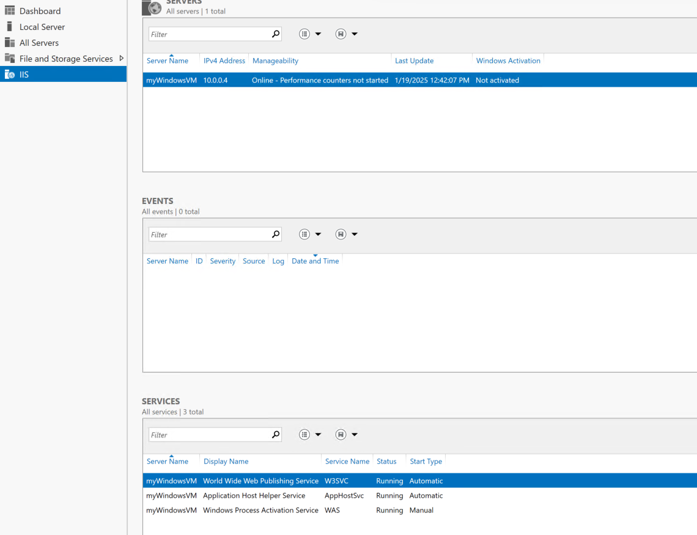
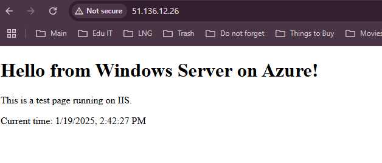
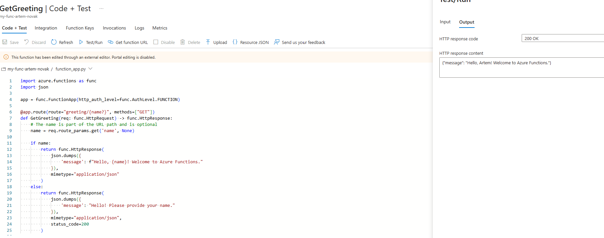

# Module 2: Azure Identity and Access Management

## Practical Task 1: Linux Virtual Machine Setup and NSG Configuration

Description: VM Creation and ssh connection

Description: Nginx Configuration

Description: NSG ports

Description: no connection HTTPS

## Practical Task 2: Windows Virtual Machine and RDP Access Setup

Description: Win Machine creation and RDP

Description: IIS

## Practical Task 3: Configuring an Azure Load Balancer

Description: Two VMs

Description: Nginx unique

Description: LB creation

Description: BE, FE, Probes

Description: Distributing traffic

## Practical Task 4: Configuring a Basic Load Balancer with Virtual Machine Scale Sets (VMSS)

Description: VMSS

Description: Scale Up

Description: custom config

Description: Traffic Distribution

## Practical Task 5: Deploying a Web Application Using Azure App Services

Description: app plan and docker as app runtime 

Description: Acr and Application

Description: Enabled logs and app itself

## Practical Task 6: Creating and Deploying an Azure Function to Process HTTP Requests

Description: func app and func code

Description: App responses
