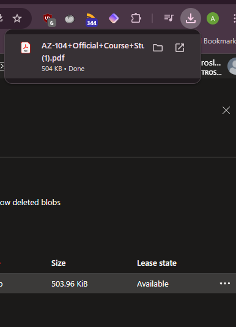
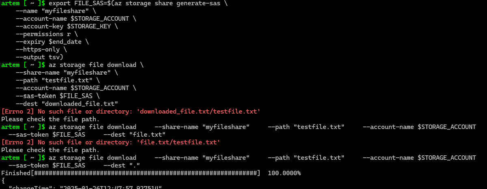
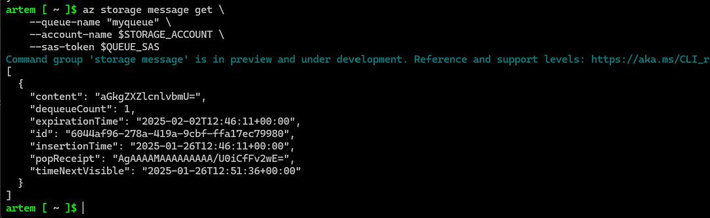
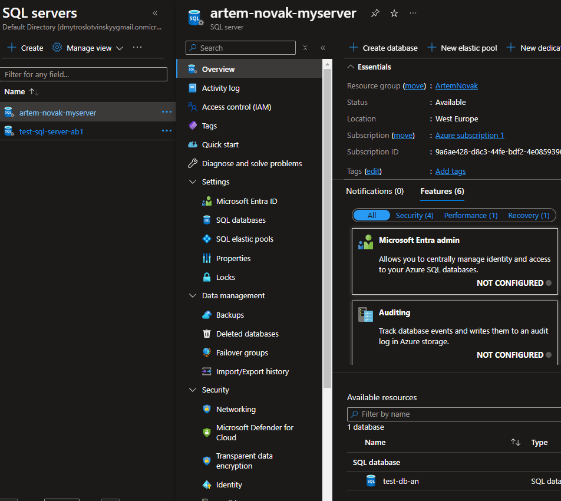

# Module 6: Azure Storage and Databases

## Practical Task 1: Upload and Retrieve Files with Azure Blob Storage

Description: Create new storage account

Description: State, Upload and Download

## Practical Task 2: Lifecycle Management for Blob Storage

Description: Uploading Multiple files

Description: Uploading Multiple files

Description: Files metadata

## Practical Task 3: Implementing an Azure Queue for Message Storage

Description: Message queue

Description: Nginx unique

## Practical Task 4: Configuring Azure File Share and Mounting on a Local Machine

Description: Fileshare

Description: Connect, upload and verify

## Practical Task 5: Storing and Querying Data with Azure Table Storage

Description: Table and data

Description: Quering data

Description: Storage explorer

## Practical Task 6: Configuring Shared Access Signatures (SAS) for Secure Access

Description: Blob Sas

Description: Other SAS

## Practical Task 7: Implementing Security Best Practices with Azure RBAC and Managed Identities

Description: Service Principal

Description: Service Principal

Description: new user error

Description: old user no error

## Practical Task 8: Creating and Querying an Azure SQL Database

Description: SQL and query

## Practical Task 9: Deploying an Azure SQL Database with Automated Backup Configuration

Description: SQL and backup

## Practical Task 10: Getting Started with Cosmos DB

Description: CosmosDB and values

Description: CosmosDB replication

Description: CosmosDB failover
