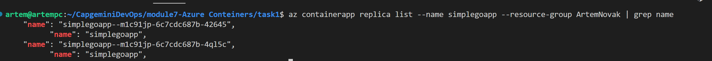
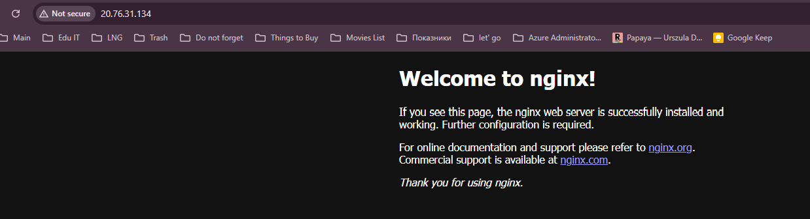
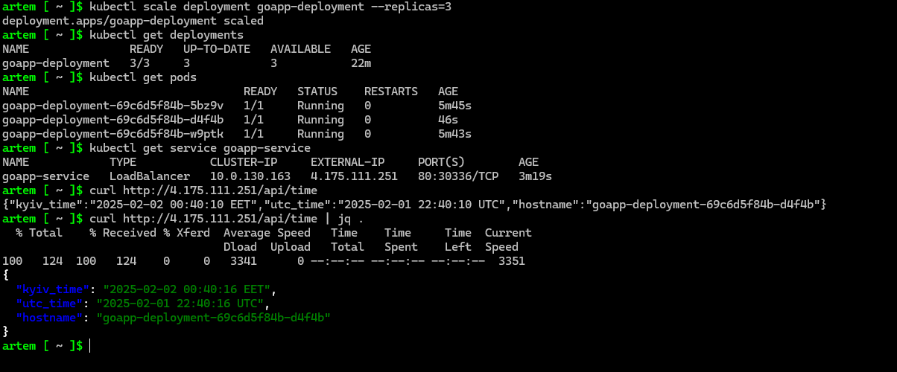

# Module 7: Azure DockerACR and Databases

## Practical Task 1: Deploy a Docker Container to Azure Container Instances (ACI) via Azure Portal

Description: Create and push docker

Description: Domain

## Practical Task 2: Configure Environment Variables in ACI via Azure Portal

Description: Env variables

## Practical Task 3: Scale Out with Azure Container Instances via Azure Portal

Description: Container App

## Practical Task 4: Secure a Docker Container in ACI with Managed Identity via Azure Portal

Description: Key Vault Access for APP

## Practical Task 5: Deploy a Kubernetes Cluster with AKS via Azure Portal

Description: AKS creation

Description: Info

## Practical Task 6: Deploy a Containerized Application on AKS

Description: Deploy with ACR

## Practical Task 7: Configure and Use ConfigMaps and Secrets in AKS

Description: AKS envs

## Practical Task 8: Scale Applications in AKS

Description: HPA

Description: Load

Description: Changes of pods

## Practical Task 9: Rolling Update of an Application in AKS

Description: Image update

## Bonus Task 10: GitOps with AKS

Description: ArgoCD
