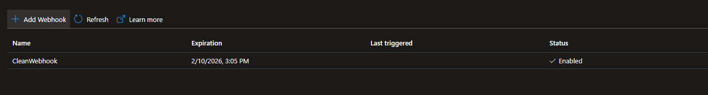
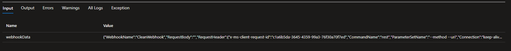

# Module 8: Azure Automation

## Practical Task 1: Install and Configure Azure CLI and PowerShell

Description: az cli and powershell

## Practical Task 2: Create and Manage Resource Groups

Description: Create group

Description: List

Description: Delete

## Practical Task 3: Deploy and Manage Virtual Machines using Azure CLI and PowerShell

Description: Deploy VM

Description: VM info

Description: Stop and Remove

## Practical Task 4: Manage Storage Accounts using Azure CLI and PowerShell

Description: Manage Storage Account

## Practical Task 5: Assign Role-Based Access Control (RBAC) Roles

Description: Create user, assing roles

Description: Verify roles and delete

## Practical Task 6: Set Up a Scalable Web Server with VM, Storage, and Networking

Description: Create group

Description: Create Vnet and subnet

Description: Create VM and storage

Description: Nginx and logs

## Practical Task 7: Create and Run an Azure Automation Runbook

Description: Runbook

## Practical Task 8: Automate Resource Cleanup Using a PowerShell Runbook

Description: Runbook webhook

## Practical Task 9: Implement Desired State Configuration (DSC) to Enforce VM Settings

Description: DSC

## Practical Task 10: Automate Multi-Resource Deployment and Configuration Using Runbooks and DSC

Description: Runbook&&DSC
