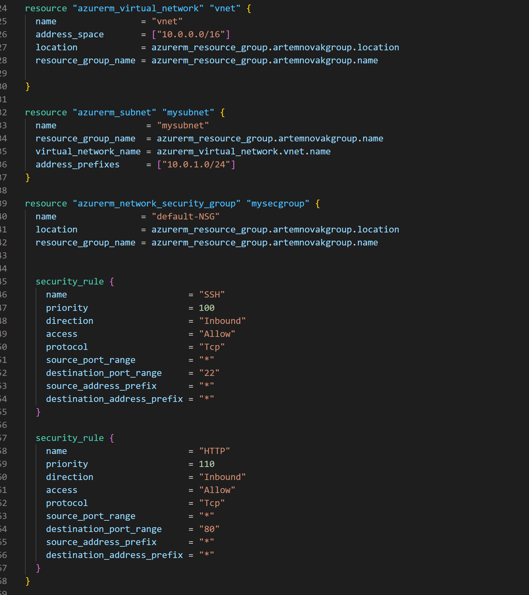
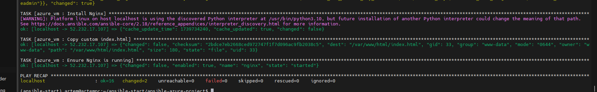

# Module 9: Azure Automation

## Practical Task 1: Install, Configure, and Manage Terraform State in Azure

Description: Installation

Description: Storage

Description: Provision

## Practical Task 2: Deploy an Azure Virtual Machine with a Custom Network and Security Rules

Description: Network

Description: Deploy and destroy

## Practical Task 3: Implement a Scalable Infrastructure with Load Balancer and Auto Scaling

Description: Complete deployment

Description: Apache and Stress

## Practical Task 4: Install and Configure Ansible for Azure

Description: Manage Storage Account

## Practical Task 5: Deploy an Azure Virtual Machine with Ansible

Description: Ansible VM and nginx

## Practical Task 6: Deploy a Scalable Azure Infrastructure with Ansible and Dynamic Inventory (optional)

Description: Create group

Description: Create Vnet and subnet

Description: Create VM and storage

Description: Nginx and logs

## Practical Task 7: Deploy a Resource Group Using an ARM Template

Description: Runbook

## Practical Task 8: Deploy an Azure Storage Account Using an ARM Template

Description: Runbook webhook

## Practical Task 9: Terraform: Deploy a Production-Ready AKS Cluster with GitOps & Secret Management & Monitoring

Description: DSC

## Practical Task 10: Deploy a Virtual Machine with Networking Using an ARM Template

Description: Runbook&&DSC

## Practical Task 11: Convert an ARM Template to Bicep

## Practical Task 12: Deploy a Multi-Resource Azure Infrastructure Using Bicep

## Practical Task 13: Implement Parameterization and Secrets Management in Bicep (optional)

## Practical Task 14: Configure Azure Monitor to Track VM Metrics and Alerts

## Practical Task 15: Create a Custom Dashboard in Azure Monitor (optional)

## Practical Task 16: Enable Application Insights for a Web Application

## Practical Task 17: Analyze Application Telemetry and Dependency Tracking

## Practical Task 18: Query and Analyze Azure Logs with Kusto Query Language (KQL)

## Practical Task 19: Implement Advanced Log Analytics Queries and Alerts (optional)